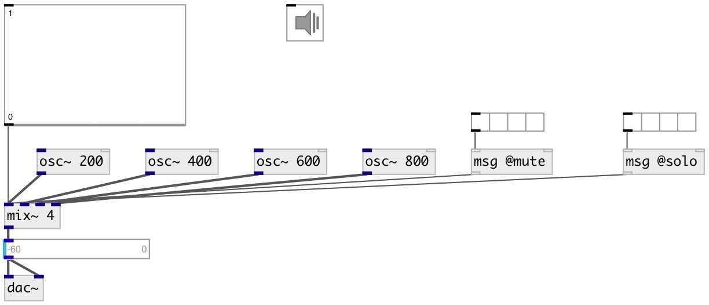

[index](index.html) :: [base](category_base.html)
---

# mix~
**aliases:** [ceammc/mix\~]

###### multislot signal mixer

*available since version:* 0.6

---

## arguments:

* **N**
number of inputs 
_type:_ int 

## methods:

* **mute**
mute specified channel 
  __parameters:__
  - **CH** channel index (from 0) 
    type: int  
    required: True  

  - **VAL** 1 - mute, 0 - unmute 
    type: int  
    required: True  

* **solo**
solo (mute all others that not solo) specified channel 
  __parameters:__
  - **CH** channel index (from 0) 
    type: int  
    required: True  

  - **[VAL]** 1 - enable solo, 0 - disable solo 
    type: int  

## properties:

* **@xfade_time** 
Get/set smooth time 
_type:_ float 
_units:_ ms 
_min value:_ 1 
_default:_ 20 

* **@value** 
Get/set linear amplitude values 
_type:_ list 
_min value:_ 0 
_default:_ 0 0 

* **@db** 
Get/set amplitude values in decibels 
_type:_ list 
_units:_ db 
_min value:_ -144 
_default:_ -144 -144 

* **@mute** 
Get/set mute channel list, allowed values: 0, 1 
_type:_ list 
_default:_ 0 0 

* **@solo** 
Get/set solo channel list, allowed values: 0, 1 
_type:_ list 
_default:_ 0 0 

## inlets:

* input signal 
_type:_ audio
* input signal 
_type:_ audio
* input signal 
_type:_ audio

## outlets:

* output mixed signal 
_type:_ audio

## keywords:

[mix](keywords/mix.html)
[amplitude](keywords/amplitude.html)
[decibel](keywords/decibel.html)

**Authors:** Serge Poltavsky

**License:** GPL3 or later

