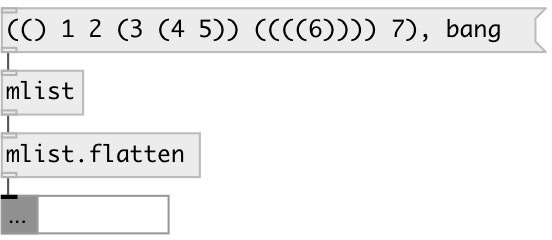

[index](index.html) :: [data](category_data.html)
---

# mlist.flatten

###### flatten nested mlist

*available since version:* 0.6

---

## inlets:

* list of mlists 
_type:_ control

## outlets:

* mlist output 
_type:_ control

## keywords:

[flatten](keywords/flatten.html)
[list](keywords/list.html)

**See also:**
[\[data.mlist\]](data.mlist.html)

**Authors:** Serge Poltavsky

**License:** GPL3 or later

