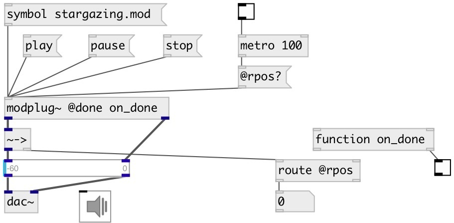

[index](index.html) :: [misc](category_misc.html)
---

# modplug~
**aliases:** [ceammc/modplug\~]

###### MOD file player (using libmodplug)

*available since version:* 0.4

---

## methods:

* **play**
play mod file 

* **pause**
pause playing 

* **stop**
stop playing and move play position to the end of file 

## properties:

* **@done** 
Get/set function called with bang when playing is finished 
_type:_ symbol 

* **@len** (readonly)
Get length of mod file 
_type:_ float 
_units:_ ms 
_default:_ 0 

* **@name** (readonly)
Get mod name 
_type:_ symbol 

* **@pos** 
Get/set position in mod file 
_type:_ float 
_units:_ ms 
_default:_ -1 

* **@rpos** 
Get/set relative position in mod file 
_type:_ float 
_range:_ 0..1 
_default:_ 0 

* **@play** 
Get/set play state 
_type:_ int 
_enum:_ 0, 1 
_default:_ 0 

## inlets:

* load mod file 
_type:_ control

## outlets:

* left channel and property output 
_type:_ audio
* right channel 
_type:_ audio

## keywords:

[mod](keywords/mod.html)
[player](keywords/player.html)

**Authors:** Serge Poltavsky

**License:** GPL3 or later

