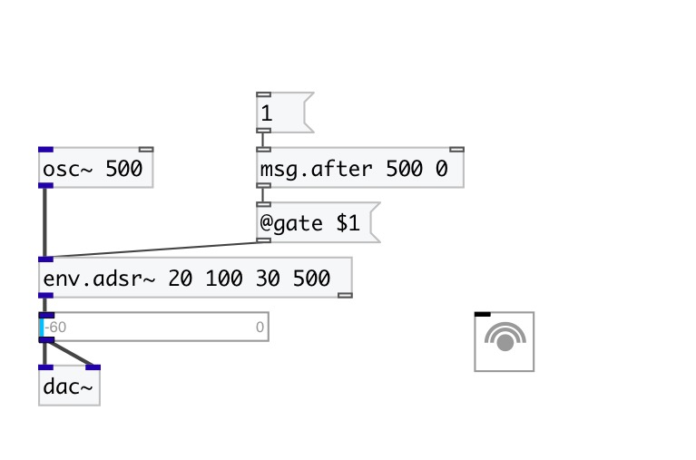

[< reference home](index.html)
---

# msg.after

send specified message after incoming message

---

if new input message received, while delayed message is not send, the delayed
            message is resetted
 

---

---
arguments:

DELAY(ms): message
            delay 
MSG: message arguments 

---
properties:

---
see also: 

