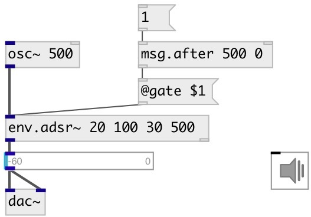

[index](index.html) :: [msg](category_msg.html)
---

# msg.after

###### send specified message after incoming message

*available since version:* 0.7

---

## information
if new input message received, while delayed message is not send, the delayed
            message is resetted

## arguments:

* **DELAY**
message delay 
_type:_ float 
_units:_ ms 

* **MSG**
message arguments 
_type:_ list 

## inlets:

* any input message 
_type:_ control
* change message delay 
_type:_ control

## outlets:

* message output 
_type:_ control

## keywords:

[message](keywords/message.html)
[after](keywords/after.html)
[onload](keywords/onload.html)

**See also:**
[\[msg\]](msg.html)

**Authors:** Serge Poltavsky

**License:** GPL3 or later

