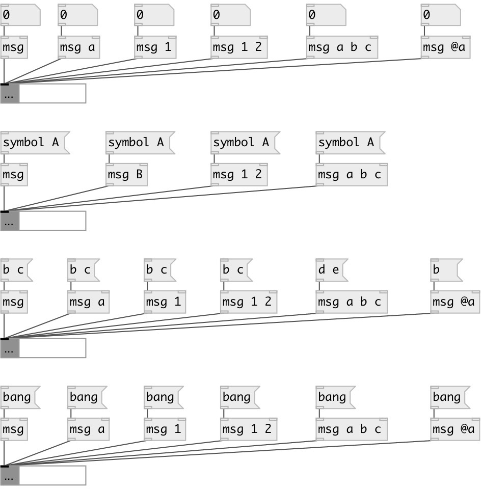

[index](index.html) :: [msg](category_msg.html)
---

# msg
**aliases:** [ceammc/msg], [ceammc/m], [m], [ceammc/prepend], [prepend]

###### message constructor

*available since version:* 0.1

---

## arguments:

* **NAME**
message selector 
_type:_ symbol 

* **X**
message content 
_type:_ any 

## inlets:

* appends all atoms to message content and outputs it 
_type:_ control
* change message selector 
_type:_ control

## outlets:

* message output 
_type:_ control

## keywords:

[msg](keywords/msg.html)
[message](keywords/message.html)

**Authors:** Serge Poltavsky

**License:** GPL3 or later

