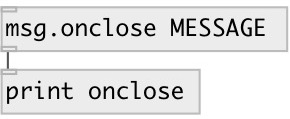

[index](index.html) :: [msg](category_msg.html)
---

# msg.onclose

###### send message when patch closes

*available since version:* 0.9.7

---

## arguments:

* **ARGS**
message. Comma separated messages are supported 
_type:_ list 

## outlets:

* message output 
_type:_ control

## keywords:

[message](keywords/message.html)
[close](keywords/close.html)

**See also:**
[\[msg.onload\]](msg.onload.html)

**Authors:** Serge Poltavsky

**License:** GPL3 or later

