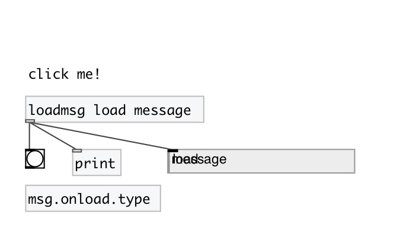

[< reference home](index.html)
---

# msg.onload

send message when patch loads

---

like [loadbang], but with message and click support.
Click on object sends message again.
 

---

---
arguments:

ARGS: message 

---
properties:

