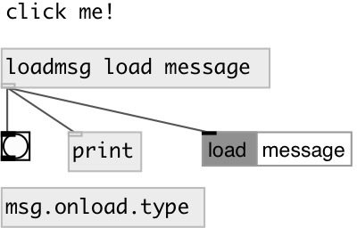

[index](index.html) :: [msg](category_msg.html)
---

# msg.onload
**aliases:** [ceammc/loadmsg], [loadmsg]

###### send message when patch loads

*available since version:* 0.7

---

## information
like [loadbang], but with message and click support.

## arguments:

* **ARGS**
message. Comma separated messages are supported 
_type:_ list 

## outlets:

* message output 
_type:_ control

## keywords:

[message](keywords/message.html)
[loadbang](keywords/loadbang.html)
[onload](keywords/onload.html)

**See also:**
[\[msg.onclose\]](msg.onclose.html)

**Authors:** Serge Poltavsky

**License:** GPL3 or later

