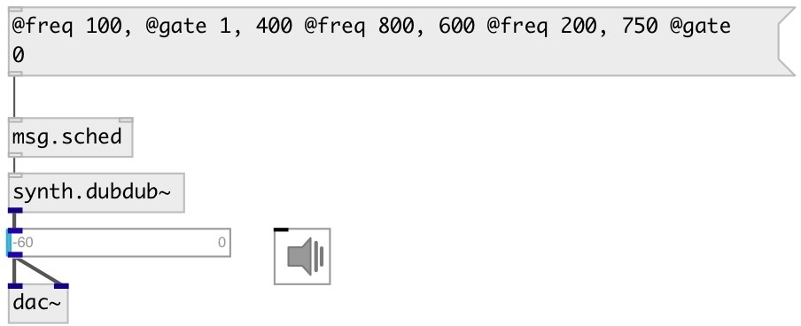

[index](index.html) :: [msg](category_msg.html)
---

# msg.sched

###### message scheduler

*available since version:* 0.9.4

---

## information
First element of input list considered as delay time in milliseconds.
Other messages passed &#39;as is&#39; immidiately.

## inlets:

* immidiately output bang 
__type:__ control 
* clear scheduled messages 
__type:__ control 

## outlets:

* message output
__type:__ control 

## keywords:

[message](keywords/message.html)
[scheduler](keywords/scheduler.html)

**See also:**
[\[msg.after\]](msg.after.html)

**Authors:** Serge Poltavsky

**License:** GPL3 or later

