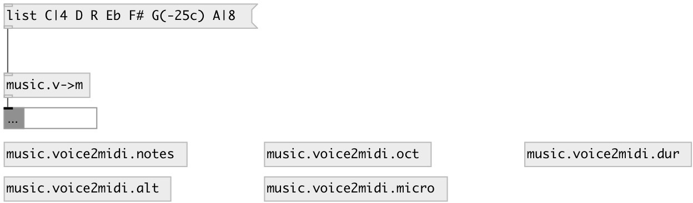

[index](index.html) :: [conv](category_conv.html)
---

# music.voice2midi
**aliases:** [music.v-&gt;m]

###### convert voice music list of midi pitches

*available since version:* 0.9.4

---

## information
Basic syntax: - pitch: C, D, E, F, G, A, B - alteration: #, ##, b or bb - octave: -1..9 or ^, _ - deviation in cents: (+-NUMc) - duration: |8, |4. or |3/8

## inlets:

* note list 
_type:_ control

## outlets:

* MIDI values 
_type:_ control

## keywords:

[conv](keywords/conv.html)
[music](keywords/music.html)
[voice](keywords/voice.html)

**Authors:** Serge Poltavsky

**License:** GPL3 or later

