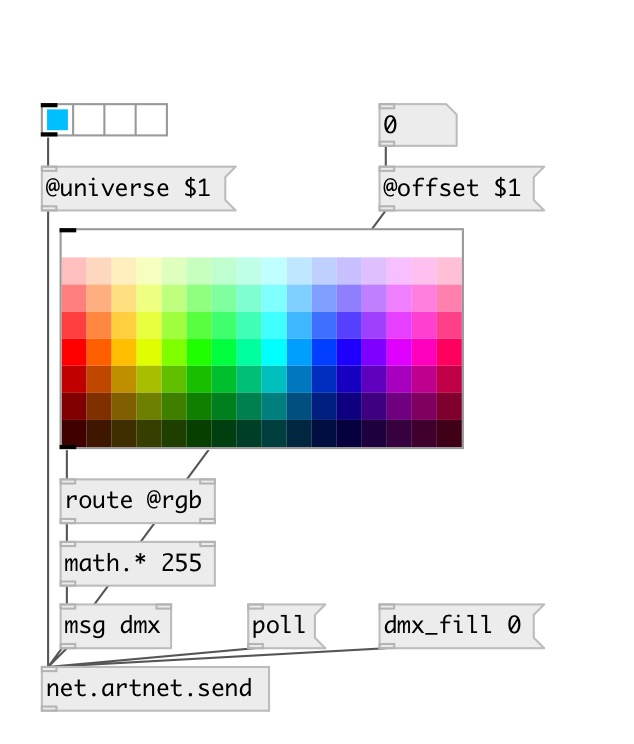

[index](index.html) :: [net](category_net.html)
---

# net.artnet.send
**aliases:** [artnet.send]

###### ArtNet DMX message sender

*available since version:* 0.9.5

---

## arguments:

* **UNIVERSE**
ArtNet universe 
_type:_ int 

## methods:

* **poll**
send poll request, dump response to Pd window 

* **dmx_fill**
set all DMX channels to given value 
  __parameters:__
  - **VAL** DMX value 
    type: int  
    required: True  

* **dmx_set**
set DMX channel value 
  __parameters:__
  - **CHAN** DMX channel 
    type: int  
    required: True  

  - **VAL** DMX value 
    type: int  
    required: True  

* **dmx**
set DMX channel values 
  __parameters:__
  - **CHAN** DMX channel 
    type: int  
    required: True  

  - **VALUES** list of DMX values, first element sets first channel etc. 
    type: list  
    required: True  

## properties:

* **@universe** 
Get/set ArtNet universe 
_type:_ int 
_range:_ 0..3 
_default:_ 0 

* **@offset** 
Get/set DMX channel offset 
_type:_ int 
_range:_ 0..511 
_default:_ 0 

## inlets:

* input 
_type:_ control

## outlets:

* output 
_type:_ control

## keywords:

[osc](keywords/osc.html)
[net](keywords/net.html)
[artnet](keywords/artnet.html)
[dmx](keywords/dmx.html)

**Authors:** Serge Poltavsky

**License:** GPL3 or later

