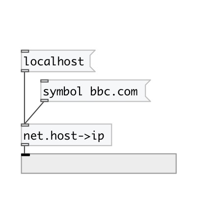

[< reference home](index.html)
---

# net.host2ip

returns IP address by DNS name

---

 

---

---
arguments:

---
properties:

@type: result IP
            type 
@ipv4: shortcut for @type ipv4 
@ipv6: shortcut for @type ipv6 

