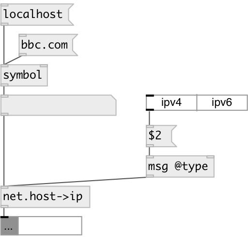

[index](index.html) :: [net](category_net.html)
---

# net.host2ip

###### returns IP address by DNS name

*available since version:* 0.7

---

## properties:

* **@type** 
Get/set result IP type 
__type:__ symbol 
__enum:__ ipv4, ipv6 
__default:__ ipv4 

* **@ipv4** 
Get/set shortcut for @type ipv4 
__type:__ alias 

* **@ipv6** 
Get/set shortcut for @type ipv6 
__type:__ alias 

## inlets:

* DNS name 
__type:__ control 

## outlets:

* list of resolved IP&#39;s
__type:__ control 

## keywords:

[net](keywords/net.html)
[dns](keywords/dns.html)
[ip](keywords/ip.html)

**Authors:** Serge Poltavsky

**License:** GPL3 or later

