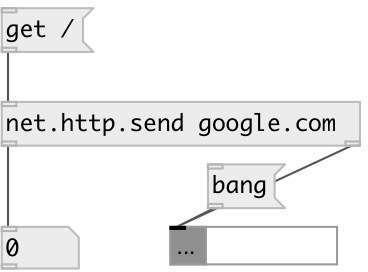

[index](index.html) :: [net](category_net.html)
---

# net.http.send
**aliases:** [http.send]

###### HTTP request sender

*available since version:* 0.9.5

---

## arguments:

* **HOST**
destination host 
_type:_ symbol 

* **PORT**
destination port 
_type:_ int 

## methods:

* **get**
send GET request 
  __parameters:__
  - **PATH** request path 
    type: symbol  
    required: True  

  - **VALUES** list of query pairs 
    type: list  
    required: True  

## properties:

* **@host** 
Get/set destination host 
_type:_ symbol 
_default:_ localhost 

* **@port** 
Get/set destination port 
_type:_ int 
_range:_ 1..32768 
_default:_ 80 

* **@user** 
Get/set Basic Auth user name 
_type:_ symbol 

* **@pass** 
Get/set Basic Auth password 
_type:_ atom 

* **@timeout** 
Get/set TCP connection timeout 
_type:_ int 
_units:_ sec 
_range:_ 1..10 
_default:_ 1 

## inlets:

* input 
_type:_ control

## outlets:

* int: HTTP status code 
_type:_ control
* data:String: HTTP body 
_type:_ control

## keywords:

[net](keywords/net.html)
[http](keywords/http.html)

**Authors:** Serge Poltavsky

**License:** GPL3 or later

