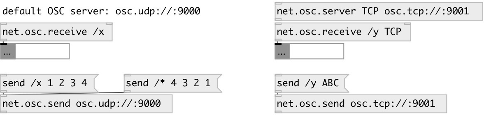

[index](index.html) :: [net](category_net.html)
---

# net.osc.receive
**aliases:** [net.osc.r]

###### OSC message listener

*available since version:* 0.9.5

---

## arguments:

* **PATH**
OSC path to listen 
_type:_ symbol 

* **SERVER**
OSC server name 
_type:_ symbol 

* **TYPES**
expected OSC type string 
_type:_ symbol 

## properties:

* **@server** 
Get/set OSC server name 
_type:_ symbol 
_default:_ default 

* **@path** 
Get/set OSC listen path 
_type:_ symbol 

* **@types** 
Get/set expected OSC type string 
_type:_ symbol 
_default:_ none 

## inlets:

* message input 
_type:_ control
* set OSC listen path 
_type:_ control

## outlets:

* OSC output 
_type:_ control

## keywords:

[osc](keywords/osc.html)
[net](keywords/net.html)
[receive](keywords/receive.html)

**See also:**
[\[net.osc.server\]](net.osc.server.html)
[\[net.osc.send\]](net.osc.send.html)

**Authors:** Serge Poltavsky

**License:** GPL3 or later

