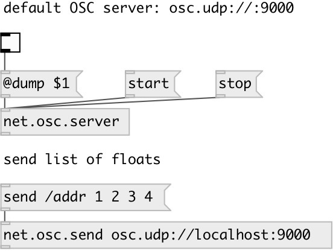

[index](index.html) :: [net](category_net.html)
---

# net.osc.server
**aliases:** [net.osc]

###### OSC server control

*available since version:* 0.9.5

---

## arguments:

* **NAME**
OSC server name (for using with other objects) 
_type:_ symbol 

* **URL**
OSC server url (like udp:12345), see @url property 
_type:_ atom 

## methods:

* **start**
start OSC server 
  __parameters:__
  - **[VAL]** 1: start, 0: stop 
    type: int  

* **stop**
stop OSC server 
  __parameters:__
  - **[VAL]** 1: stop, 0: start 
    type: int  

## properties:

* **@dump** 
Get/set dump incoming messages to Pd window 
_type:_ bool 
_default:_ 0 

* **@auto_start** 
Get/set automatically start on creation 
_type:_ bool 
_default:_ 1 

* **@url** (initonly)
Get/set OSC server url in form: PROTO:PORT (udp:12345) or just PORT, or
osc.PROTO://:PORT (for ex. osc.tcp://:9001) 
_type:_ atom 
_default:_ udp:9000 

* **@name** (initonly)
Get/set OSC server name 
_type:_ symbol 
_default:_ default 

* **@port** (readonly)
Get OSC server port 
_type:_ int 
_default:_ 9000 

* **@path** (readonly)
Get OSC server local socket path 
_type:_ symbol 

* **@proto** (readonly)
Get OSC server proto (udp or tcp) 
_type:_ symbol 
_default:_ udp 

* **@host** (readonly)
Get OSC server host 
_type:_ symbol 

## inlets:

* ... 
_type:_ control

## outlets:

* ... 
_type:_ control

## keywords:

[net](keywords/net.html)
[osc](keywords/osc.html)
[server](keywords/server.html)

**See also:**
[\[net.osc.send\]](net.osc.send.html)
[\[net.osc.receive\]](net.osc.receive.html)

**Authors:** Serge Poltavsky

**License:** GPL3 or later

