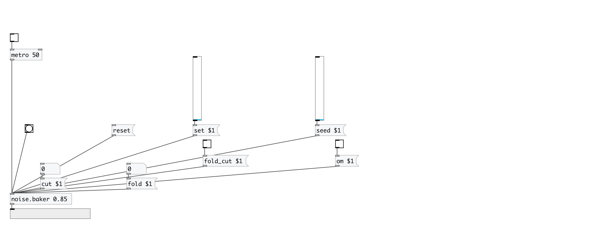

[< reference home](index.html)
---

# noise.baker

Part of a-chaos library

---

Port of Richard&#39;s chaos-baker from chaos collection
 

---

---
arguments:

ARG0: initial value 

---
properties:

