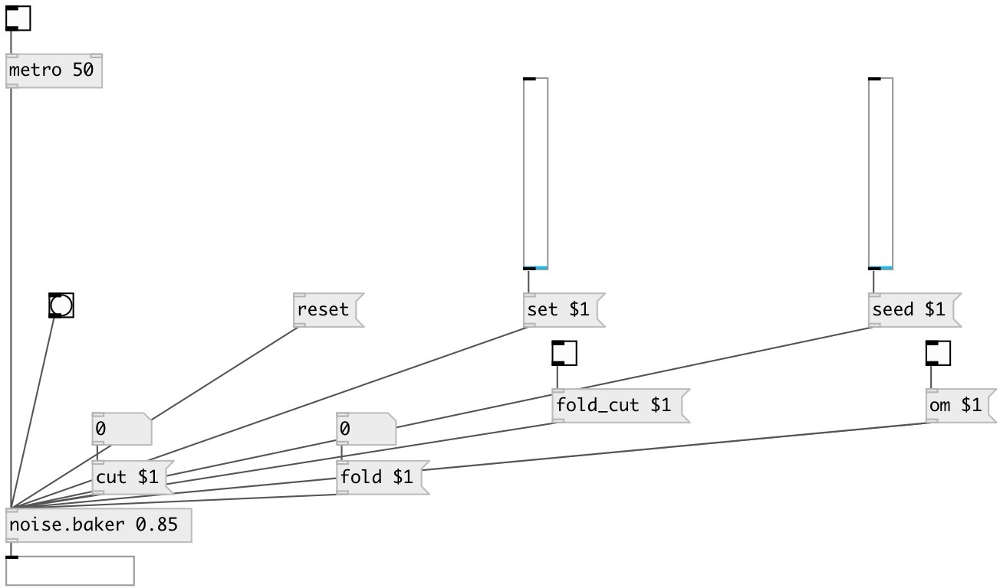

[index](index.html) :: [noise](category_noise.html)
---

# noise.baker

###### Part of a-chaos library

*available since version:* .5

---

## information
Port of Richard&#39;s chaos-baker from chaos collection

## arguments:

* **ARG0**
initial value 
_type:_ float 

## methods:

* **seed**
 
  __parameters:__
  - **SEED** seed value 
    type: float  
    required: True  

* **set**
 
  __parameters:__
  - **SET** set to value 
    type: float  
    required: True  

* **reset**
reset state 

* **om**
 
  __parameters:__
  - **OM** enables output when cut or fold value is changed 
    type: int  
    required: True  

* **fold**
 
  __parameters:__
  - **FOLD** fold value [0..1] 
    type: float  
    required: True  

* **cut**
 
  __parameters:__
  - **CUT** cut value [0..1] 
    type: float  
    required: True  

* **fold_cut**
 
  __parameters:__
  - **FOLD_CUT** enable fold / cut value action 
    type: int  
    required: True  

## inlets:

* output value 
_type:_ control

## outlets:

* main outlet 
_type:_ control

## keywords:

[noise](keywords/noise.html)

**Authors:** André Sier

**License:** %

