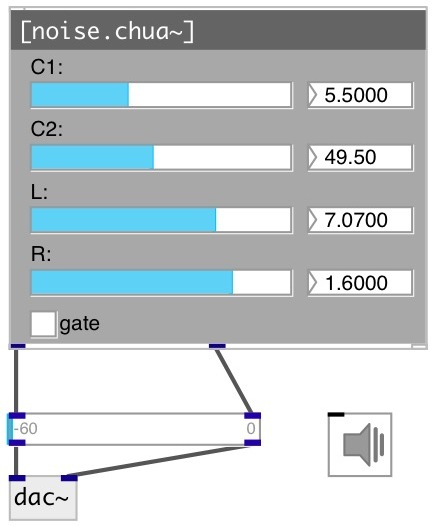

[index](index.html) :: [synth](category_synth.html)
---

# noise.chua~

###### Chua&#39;s diode circuit

*available since version:* 0.9.6

---

## methods:

* **reset**
reset generator 

* **start**
start generator 

## properties:

* **@gate** 
Get/set play trigger &gt;0: on, 0: off. To set output gain to 0.5 you can 0.5 as trigger
value 
_type:_ float 
_range:_ 0..1 
_default:_ 0 

* **@active** 
Get/set on/off dsp processing 
_type:_ bool 
_default:_ 1 

* **@C1** 
Get/set C1 capacity in nF 
_type:_ float 
_range:_ 5.2..6 
_default:_ 5.5 

* **@C2** 
Get/set C2 capacity in nF 
_type:_ float 
_range:_ 40..60 
_default:_ 49.5 

* **@R** 
Get/set R resistance in kOhm 
_type:_ float 
_range:_ 1.252..1.7 
_default:_ 1.6 

* **@L** 
Get/set L in mH 
_type:_ float 
_range:_ 6.5..7.3 
_default:_ 7.07 

## inlets:

* play with default duration and full gain 
_type:_ control

## outlets:

* X output (C1 Vout) 
_type:_ audio
* Y output (C2 Vout) 
_type:_ audio

## keywords:

[noise](keywords/noise.html)
[chua](keywords/chua.html)
[chaos](keywords/chaos.html)

**Authors:** Serge Poltavsky

**License:** GPL3 or later

