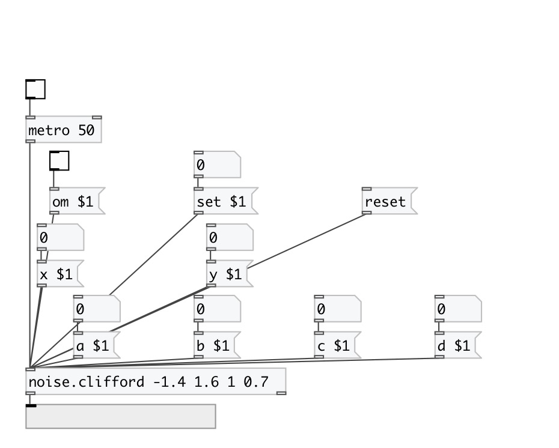

[< reference home](index.html)
---

# noise.clifford

Part of a-chaos library

---

Clifford Attractors

Attributed to Cliff Pickover
---
 
See also Peter de Jong attractors 
 
 xn+1 = sin(a yn) + c cos(a xn)
 
 yn+1 = sin(b xn) + d cos(b yn)
 
 where a, b, c, d are variabies that define each attractor.
---
 
 a = -1.4, b = 1.6, c = 1.0, d = 0.7
 
 a = 1.1, b = -1.0, c = 1.0, d = 1.5
 
 a = 1.6, b = -0.6, c = -1.2, d = 1.6
 
 a = 1.7, b = 1.7, c = 0.06, d = 1.2
 
 a = 1.3, b = 1.7, c = 0.5, d = 1.4
---
 a-chaos v1.0.2

 

---

---
arguments:

ARG0: x value (optional) 
ARG1: y value (optional) 
ARG2: a value (optional) 
ARG3: b value (optional) 
ARG4: c value (optional) 
ARG5: d value (optional) 

---
properties:

