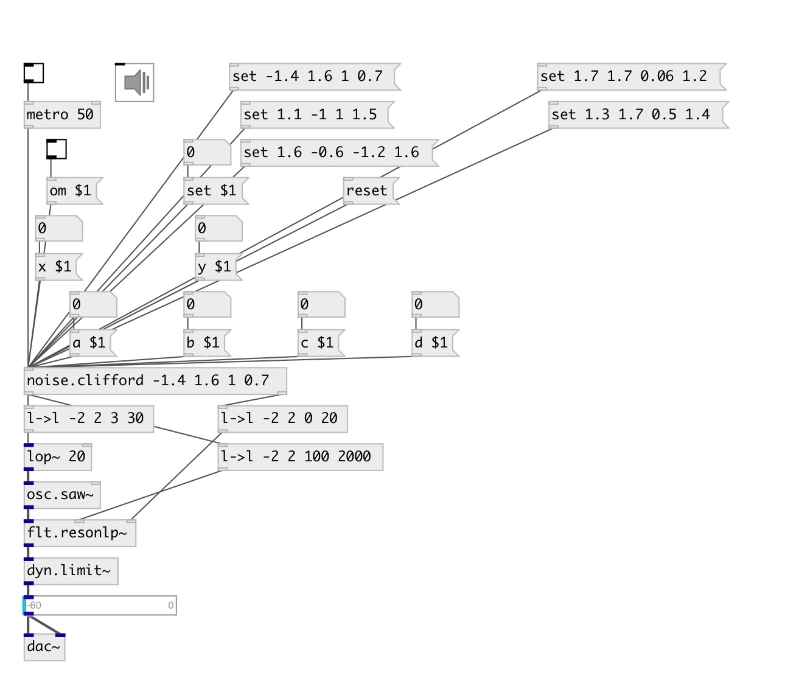

[index](index.html) :: [noise](category_noise.html)
---

# noise.clifford

###### Part of a-chaos library

*available since version:* .5

---

## information
Clifford Attractors
Attributed to Cliff Pickover
---
See also Peter de Jong attractors
xn+1 = sin(a yn) + c cos(a xn)
yn+1 = sin(b xn) + d cos(b yn)
where a, b, c, d are variabies that define each attractor.
---
a = -1.4, b = 1.6, c = 1.0, d = 0.7
a = 1.1, b = -1.0, c = 1.0, d = 1.5
a = 1.6, b = -0.6, c = -1.2, d = 1.6
a = 1.7, b = 1.7, c = 0.06, d = 1.2
a = 1.3, b = 1.7, c = 0.5, d = 1.4
---
a-chaos v1.0.2

## arguments:

* **ARG0**
x value (optional) 
_type:_ float 

* **ARG1**
y value (optional) 
_type:_ float 

* **ARG2**
a value (optional) 
_type:_ float 

* **ARG3**
b value (optional) 
_type:_ float 

* **ARG4**
c value (optional) 
_type:_ float 

* **ARG5**
d value (optional) 
_type:_ float 

## methods:

* **set**
 
  __parameters:__
  - **SET** set to value 
    type: float  
    required: True  

* **reset**
reset state 

* **om**
 
  __parameters:__
  - **OM** enables output when cut or fold value is changed 
    type: int  
    required: True  

* **a**
 
  __parameters:__
  - **A** a value 
    type: float  
    required: True  

* **b**
 
  __parameters:__
  - **B** b value 
    type: float  
    required: True  

* **c**
 
  __parameters:__
  - **C** c value 
    type: float  
    required: True  

* **d**
 
  __parameters:__
  - **D** d value 
    type: float  
    required: True  

* **x**
 
  __parameters:__
  - **X** x value 
    type: float  
    required: True  

* **y**
 
  __parameters:__
  - **Y** y value 
    type: float  
    required: True  

## inlets:

* output value 
_type:_ control

## outlets:

* main outlet 
_type:_ control

## keywords:

[noise](keywords/noise.html)

**Authors:** André Sier

**License:** %

