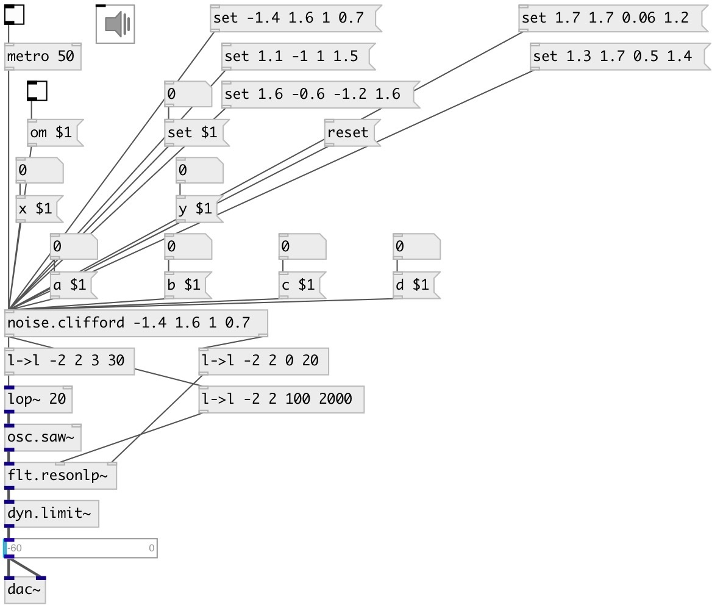

[index](index.html) :: [noise](category_noise.html)
---

# noise.clifford

###### clifford attractor

*available since version:* 0.5

---

## information
Clifford Attractors Attributed to Cliff Pickover x[n+1] = sin(a*y[n]) + c*cos(a*x[n]) y[n+1] = sin(b*x[n]) + d*cos(b*y[n]) where a, b, c, d are variables that define each attractor.

## arguments:

* **X**
x value (optional) 
_type:_ float 

* **Y**
y value (optional) 
_type:_ float 

* **A**
a value (optional) 
_type:_ float 

* **B**
b value (optional) 
_type:_ float 

* **C**
c value (optional) 
_type:_ float 

* **D**
d value (optional) 
_type:_ float 

## methods:

* **set**
 
  __parameters:__
  - **SET** set to value 
    type: float  
    required: True  

* **reset**
reset state 

* **om**
 
  __parameters:__
  - **OM** enables output when cut or fold value is changed 
    type: int  
    required: True  

* **a**
 
  __parameters:__
  - **A** a value 
    type: float  
    required: True  

* **b**
 
  __parameters:__
  - **B** b value 
    type: float  
    required: True  

* **c**
 
  __parameters:__
  - **C** c value 
    type: float  
    required: True  

* **d**
 
  __parameters:__
  - **D** d value 
    type: float  
    required: True  

* **x**
 
  __parameters:__
  - **X** x value 
    type: float  
    required: True  

* **y**
 
  __parameters:__
  - **Y** y value 
    type: float  
    required: True  

## inlets:

* output value 
_type:_ control

## outlets:

* x output 
_type:_ control
* y output 
_type:_ control

## keywords:

[noise](keywords/noise.html)

**Authors:** André Sier

**License:** BSD

