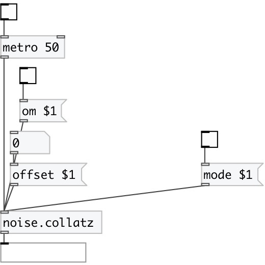

[index](index.html) :: [noise](category_noise.html)
---

# noise.collatz

###### Part of a-chaos library

*available since version:* .5

---

## information
Collatz conjecture output

## methods:

* **offset**
 
  __parameters:__
  - **OFFSET** offset value 
    type: float  
    required: True  

* **mode**
 
  __parameters:__
  - **MODE** mode value. 0 for Collatz, 1 for Terras 
    type: int  
    required: True  

* **om**
 
  __parameters:__
  - **OM** enables output when cut or fold value is changed 
    type: int  
    required: True  

## inlets:

* output value 
__type:__ control 

## outlets:

* main outlet
__type:__ control 

## keywords:

[noise](keywords/noise.html)

**Authors:** André Sier

**License:** %

