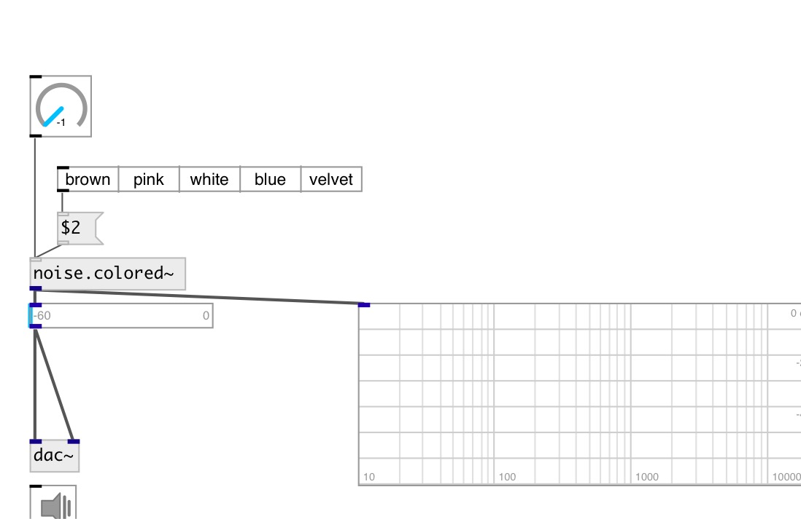

[index](index.html) :: [noise](category_noise.html)
---

# noise.colored~

###### colored noise generator with an arbitrary spectral roll

*available since version:* 0.9.6

---

## information
Generates a colored noise signal with an arbitrary spectral roll-off factor (alpha) over the entire audible frequency range (20-20000 Hz). The output is normalized so that an equal RMS level is maintained for different values of alpha.

## arguments:

* **ALPHA**
slope of roll-off, between -1 and 1. -1 corresponds to brown/red noise, -1/2
pink noise, 0 white noise, 1/2 blue noise, and 1 violet/azure noise. 
_type:_ float 

## methods:

* **blue**
set to blue noise (roll-off factor 0.5) 

* **brown**
set to brown/red noise (roll-off factor -1) 

* **pink**
set to pink noise (roll-off factor -0.5) 

* **velvet**
set to velvet noise (roll-off factor 1) 

* **white**
set to white noise (roll-off factor 0) 

## properties:

* **@alpha** 
Get/set slope of roll-off, between -1 and 1. -1 corresponds to brown/red noise, -1/2
pink noise, 0 white noise, 1/2 blue noise, and 1 violet/azure noise. 
_type:_ float 
_range:_ -1..1 
_default:_ 0 

* **@active** 
Get/set on/off dsp processing 
_type:_ bool 
_default:_ 1 

* **@osc** (initonly)
Get/set OSC server name to listen 
_type:_ symbol 

* **@id** (initonly)
Get/set OSC address id. If specified, bind all properties to
/ID/noise_colored/PROP_NAME osc address, if empty bind to
/noise_colored/PROP_NAME. 
_type:_ symbol 

## inlets:

* set roll-off frequency 
_type:_ control

## outlets:

* output signal 
_type:_ audio

## keywords:

[noise](keywords/noise.html)
[colored](keywords/colored.html)
[white](keywords/white.html)
[red](keywords/red.html)
[brown](keywords/brown.html)
[blue](keywords/blue.html)
[velvet](keywords/velvet.html)

**Authors:** Serge Poltavsky

**License:** GPL3 or later

