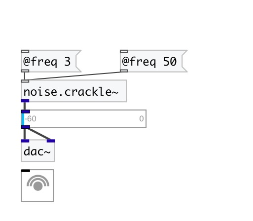

[< reference home](index.html)
---

# noise.crackle~

sparse noise generator

---

Random impulses in the amplitude range -1 to 1 are generated at an average rate of
            @freq impulses per second
 

---

---
arguments:

FREQ: average frequency of noise impulses per
            second 

---
properties:

@freq: average
            frequency of noise impulses per second 
@active: on/off dsp
            processing 

