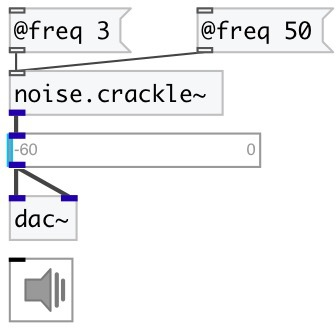

[index](index.html) :: [noise](category_noise.html)
---

# noise.crackle~

###### sparse noise generator

*available since version:* 0.6

---

## information
Random impulses in the amplitude range -1 to 1 are generated at an average rate of @freq impulses per second

## arguments:

* **FREQ**
average frequency of noise impulses per second 
_type:_ float 
_units:_ Hz 

## properties:

* **@freq** 
Get/set average frequency of noise impulses per second 
_type:_ float 
_units:_ Hz 
_range:_ 0..100 
_default:_ 10 

* **@active** 
Get/set on/off dsp processing 
_type:_ bool 
_default:_ 1 

## inlets:

* set average frequency 
_type:_ control

## outlets:

* output signal 
_type:_ audio

## keywords:

[noise](keywords/noise.html)
[crackle](keywords/crackle.html)

**Authors:** Serge Poltavsky

**License:** GPL3 or later

