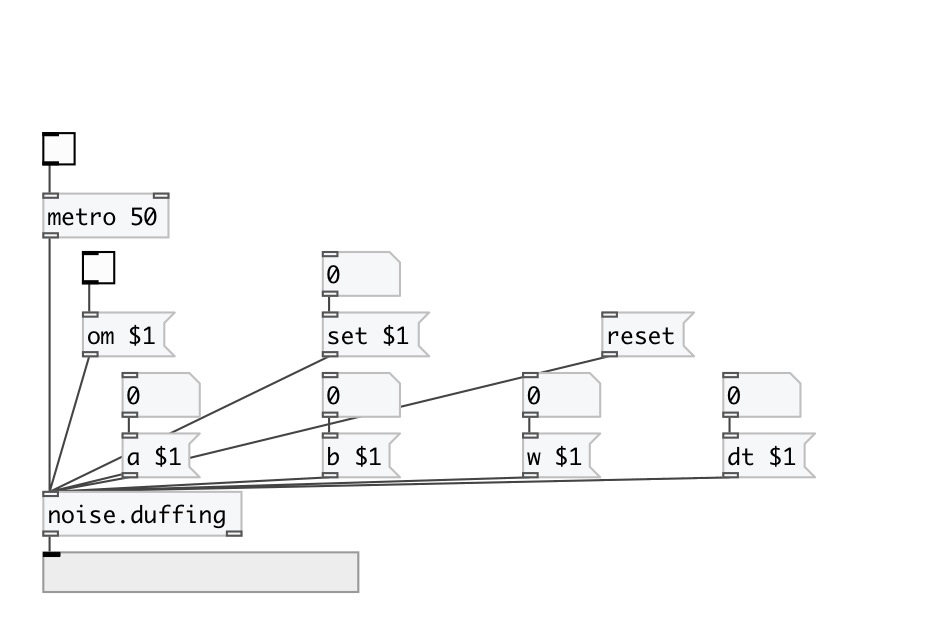

[< reference home](index.html)
---

# noise.duffing

Part of a-chaos library

---

Duffing Attractor
Written by Paul Bourke
March 1998
---
The solution to the Duffing equations is often used as an example of a classic chaotic system.
The Duffing system of differential equations is:
===========
dx / dt = y
dy / dt = x - x3 - a y + b cos(w t)
===================================
where typically, a = 0.25, b = 0.3, w = 1
The following shows a &#34;typical&#34; segment of (x,y) values.
 

---

---
arguments:

ARG0: a value (default 0.25), optional 
ARG1: b value (default 0.3), optional 
ARG2: w value (default 1.0), optional 
ARG3: dt value (default 0.01), optional 

---
properties:

