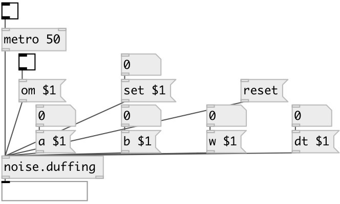

[index](index.html) :: [noise](category_noise.html)
---

# noise.duffing

###### duffing attractor

*available since version:* 0.5

---

## information
Duffing Attractor Written by Paul Bourke --- The solution to the Duffing equations is often used as an example of a classic chaotic system. The Duffing system of differential equations is: =========== dx / dt = y dy / dt = x - x3 - a y + b cos(w t) =================================== where typically, a = 0.25, b = 0.3, w = 1 The following shows a &#34;typical&#34; segment of (x,y) values.

## arguments:

* **A**
a value (default 0.25), optional 
_type:_ float 

* **B**
b value (default 0.3), optional 
_type:_ float 

* **W**
w value (default 1.0), optional 
_type:_ float 

* **DT**
dt value (default 0.01), optional 
_type:_ float 

## methods:

* **set**
 
  __parameters:__
  - **SET** set to value 
    type: float  
    required: True  

* **reset**
reset state 

* **om**
 
  __parameters:__
  - **OM** enables output when cut or fold value is changed 
    type: int  
    required: True  

* **a**
 
  __parameters:__
  - **A** a value 
    type: float  
    required: True  

* **b**
 
  __parameters:__
  - **B** b value 
    type: float  
    required: True  

* **w**
 
  __parameters:__
  - **W** w value 
    type: float  
    required: True  

* **dt**
 
  __parameters:__
  - **DT** dt value 
    type: float  
    required: True  

## inlets:

* output value 
_type:_ control

## outlets:

* dx output 
_type:_ control
* dy output 
_type:_ control

## keywords:

[noise](keywords/noise.html)

**Authors:** Paul Bourke, André Sier

**License:** %

