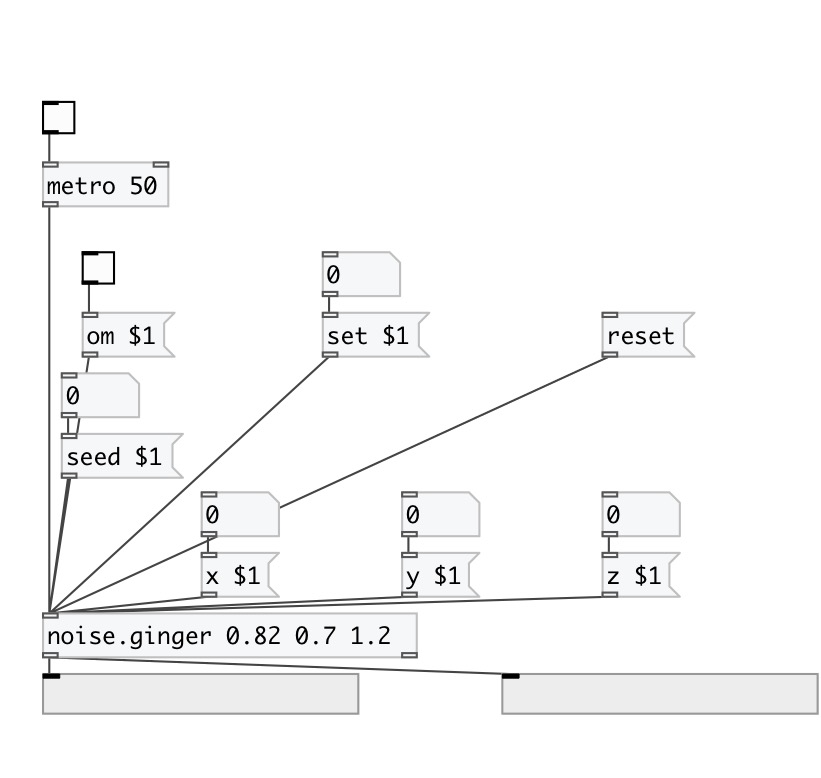

[< reference home](index.html)
---

# noise.ginger

Part of a-chaos library

---

chaos-ginger.a
inputs
1 == z/seed defaults (0.82) // x, y default to (0.7,1.2)
outputs:
(2d)
formulae:
dx/dt = 1. -y - z*abs(x)
dy/dt = x
---
try these arguments:
0.82 0.7 1.2
0.92 0.7 1.3
0.82 0.7 1.7
 

---

---
arguments:

ARG0: x value (optional) 
ARG1: y value (optional) 
ARG2: z value (optional) 

---
properties:

