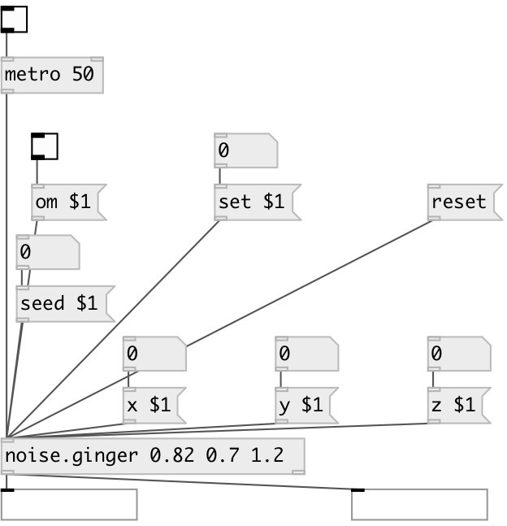

[index](index.html) :: [noise](category_noise.html)
---

# noise.ginger

###### Gingerbreadman map chaotic generator

*available since version:* 0.1

---

## information
A non-interpolating generator based on the difference equations:
x(n+1) = 1 - y(n) + seed * |x(n)|
y(n+1) = x(n)

## arguments:

* **SEED**
seed value, default 0.82 
_type:_ float 

* **X**
initial x value, default 0.7 
_type:_ float 

* **Y**
initial y value, default 1.2 
_type:_ float 

## methods:

* **set**
set seed, x and y values, updates defaults 

* **x**
set x value and update default 

* **y**
set y value and update default 

* **seed**
set seed value and update default 

* **reset**
reset seed, x and y values to defaults 

## inlets:

* outputs current x/y values and generates new one 
_type:_ control

## outlets:

* outputs x-value 
_type:_ control
* outputs y-value 
_type:_ control

## keywords:

[chaos](keywords/chaos.html)
[generator](keywords/generator.html)
[gingerbreadman](keywords/gingerbreadman.html)

**See also:**
[\[chaos.gbman0\]](chaos.gbman0.html)

**Authors:** André Sier

**License:** GPL3 or later

