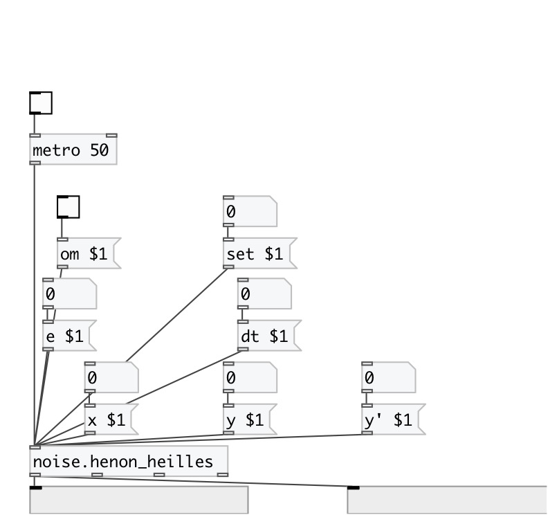

[< reference home](index.html)
---

# noise.henon_heilles

Part of a-chaos library

---

a port of Richard&#39;s chaos-henon-heilles from chaos collection
 

---

---
arguments:

ARG0: x value (optional) 
ARG1: y value (optional) 
ARG2: y&#39; value (optional) 
ARG3: e value (optional) 
ARG4: dt value (optional) 

---
properties:

