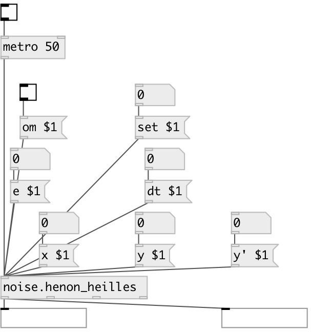

[index](index.html) :: [noise](category_noise.html)
---

# noise.henon_heilles

###### Part of a-chaos library

*available since version:* .5

---

## information
a port of Richard&#39;s chaos-henon-heilles from chaos collection

## arguments:

* **ARG0**
x value (optional) 
__type:__ float 

* **ARG1**
y value (optional) 
__type:__ float 

* **ARG2**
y&#39; value (optional) 
__type:__ float 

* **ARG3**
e value (optional) 
__type:__ float 

* **ARG4**
dt value (optional) 
__type:__ float 

## methods:

* **set**
 
  __parameters:__
  - **SET** set to value 
    type: float  
    required: True  

* **reset**
reset state 

* **x**
 
  __parameters:__
  - **NX** x value 
    type: float  
    required: True  

* **y**
 
  __parameters:__
  - **NY** y value 
    type: float  
    required: True  

* **y&#39;**
 
  __parameters:__
  - **NY** y&#39; value 
    type: float  
    required: True  

* **e**
 
  __parameters:__
  - **NY** e value 
    type: float  
    required: True  

* **dt**
 
  __parameters:__
  - **NY** dt value 
    type: float  
    required: True  

## inlets:

* output value 
__type:__ control 

## outlets:

* x outlet
__type:__ control 
* y outlet
__type:__ control 

## keywords:

[noise](keywords/noise.html)

**Authors:** Richard Dudas, André Sier

**License:** %

