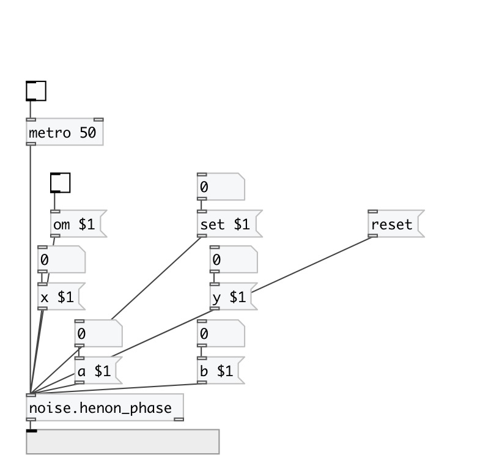

[< reference home](index.html)
---

# noise.henon_phase

Part of a-chaos library

---

Henon Phase Diagrams
Written by Paul Bourke
January 1991
xn+1 = xn cos(a) - (yn - xn2) sin(a) 
yn+1 = xn sin(a) + (yn - xn2) cos(a) 
 

---

---
arguments:

ARG0: a value (optional) 
ARG1: b value (optional) 
ARG2: x value (optional) 
ARG3: y value (optional) 

---
properties:

