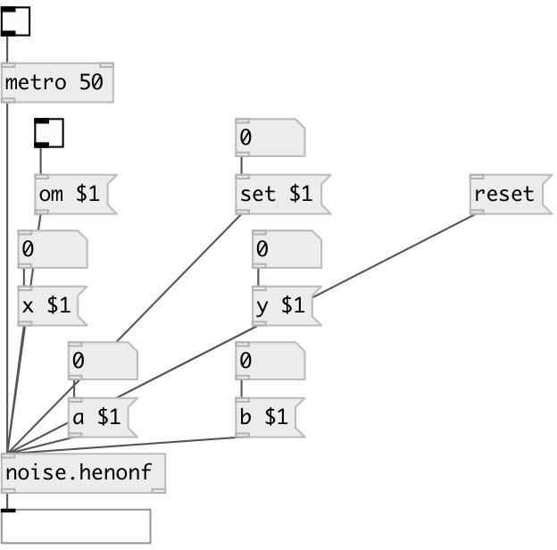

[index](index.html) :: [noise](category_noise.html)
---

# noise.henonf

###### Henon phase

*available since version:* 0.5

---

## information
Another &#39;Henon phase&#39; implementation by André Sier

## arguments:

* **A**
a value (optional) 
_type:_ float 

* **B**
b value (optional) 
_type:_ float 

* **X**
x value (optional) 
_type:_ float 

* **Y**
y value (optional) 
_type:_ float 

## methods:

* **a**
 
  __parameters:__
  - **A** a value 
    type: float  
    required: True  

* **b**
 
  __parameters:__
  - **B** b value 
    type: float  
    required: True  

* **dt**
 
  __parameters:__
  - **DT** dt value 
    type: float  
    required: True  

* **om**
 
  __parameters:__
  - **OM** enables output when cut or fold value is changed 
    type: int  
    required: True  

* **reset**
reset state 

* **set**
 
  __parameters:__
  - **SET** set to value 
    type: float  
    required: True  

* **x**
 
  __parameters:__
  - **X** x value 
    type: float  
    required: True  

* **y**
 
  __parameters:__
  - **Y** y value 
    type: float  
    required: True  

## inlets:

* output value 
_type:_ control

## outlets:

* x outlet 
_type:_ control
* y outlet 
_type:_ control

## keywords:

[noise](keywords/noise.html)

**Authors:** Paul Bourke, André Sier

**License:** %

