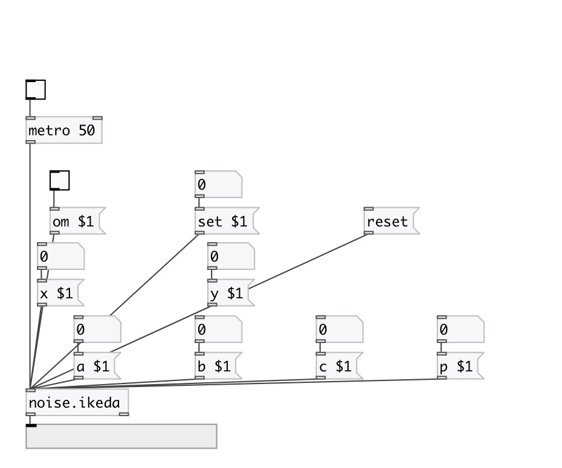

[< reference home](index.html)
---

# noise.ikeda

Part of a-chaos library

---

Ikeda attractor
---------------
zn+1 = a + b zn exp[ i k - i p / (1 + | zn2 | ) ]
---
where z is a complex number
real number formula by euler returns:
===
xn+1 = a + k*( x0*cos(b-(p/(1+x0*x0+y0*y0))) - y0*sin(b-(p/(1*x0*x0+y0*y0))) )
yn+1 =     k*( x0*sin(b-(p/(1+x0*x0+y0*y0))) - y0*cos(b-(p/(1*x0*x0+y0*y0))) )
===
a = 0.85, b = 0.9, k = 0.4, p = 7.7
a = 1.0, b = 0.9, k = 0.4, p = 6.0
 

---

---
arguments:

ARG0: a value (optional) 
ARG1: b value (optional) 
ARG2: k value (optional) 
ARG3: p value (optional) 
ARG4: nx value (optional) 
ARG5: ny value (optional) 

---
properties:

