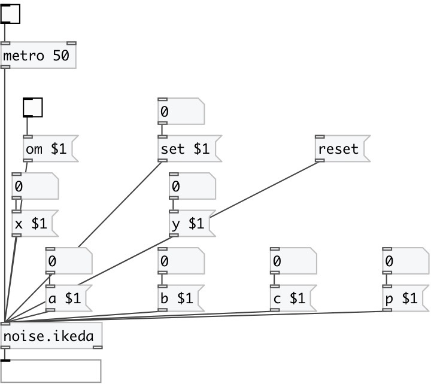

[index](index.html) :: [noise](category_noise.html)
---

# noise.ikeda

###### Part of a-chaos library

*available since version:* .5

---

## information
Ikeda attractor --------------- zn+1 = a + b zn exp[ i k - i p / (1 + | zn2 | ) ] --- where z is a complex number real number formula by euler returns: === xn+1 = a + k*( x0*cos(b-(p/(1+x0*x0+y0*y0))) - y0*sin(b-(p/(1*x0*x0+y0*y0))) ) yn+1 = k*( x0*sin(b-(p/(1+x0*x0+y0*y0))) - y0*cos(b-(p/(1*x0*x0+y0*y0))) ) === a = 0.85, b = 0.9, k = 0.4, p = 7.7 a = 1.0, b = 0.9, k = 0.4, p = 6.0

## arguments:

* **ARG0**
a value (optional) 
_type:_ float 

* **ARG1**
b value (optional) 
_type:_ float 

* **ARG2**
k value (optional) 
_type:_ float 

* **ARG3**
p value (optional) 
_type:_ float 

* **ARG4**
nx value (optional) 
_type:_ float 

* **ARG5**
ny value (optional) 
_type:_ float 

## methods:

* **set**
 
  __parameters:__
  - **SET** set to value 
    type: float  
    required: True  

* **reset**
reset state 

* **om**
 
  __parameters:__
  - **OM** enables output when cut or fold value is changed 
    type: int  
    required: True  

* **a**
 
  __parameters:__
  - **A** a value 
    type: float  
    required: True  

* **b**
 
  __parameters:__
  - **B** b value 
    type: float  
    required: True  

* **c**
 
  __parameters:__
  - **K** k value (note the &#34;c&#34; method in original a-chaos library) 
    type: float  
    required: True  

* **p**
 
  __parameters:__
  - **P** p value 
    type: float  
    required: True  

* **x**
 
  __parameters:__
  - **NX** x value 
    type: float  
    required: True  

* **y**
 
  __parameters:__
  - **NY** y value 
    type: float  
    required: True  

## inlets:

* output value 
_type:_ control

## outlets:

* main outlet 
_type:_ control

## keywords:

[noise](keywords/noise.html)

**Authors:** André Sier

**License:** %

