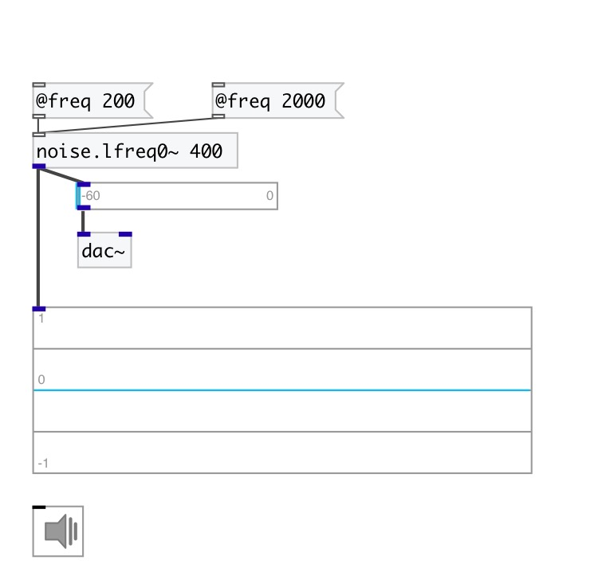

[index](index.html) :: [noise](category_noise.html)
---

# noise.lfreq0~

###### sampled/held noise (piecewise constant)

*available since version:* 0.6

---

## information
new random number every int(SR/freq) samples or so

## arguments:

* **FREQ**
noise generation freq 
_type:_ float 
_units:_ Hz 

## properties:

* **@freq** 
Get/set noise generation freq. New random number every int(SR/freq) 
_type:_ float 
_units:_ Hz 
_range:_ 0.5..22050 
_default:_ 1000 

* **@active** 
Get/set on/off dsp processing 
_type:_ bool 
_default:_ 1 

* **@osc** (initonly)
Get/set OSC server name to listen 
_type:_ symbol 

* **@id** (initonly)
Get/set OSC address id. If specified, bind all properties to /ID/noise_lfreq0/PROP_NAME
osc address, if empty bind to /noise_lfreq0/PROP_NAME. 
_type:_ symbol 

## inlets:

* set average frequency 
_type:_ control

## outlets:

* output signal 
_type:_ audio

## keywords:

[noise](keywords/noise.html)
[white](keywords/white.html)

**See also:**
[\[noise.lfreq~\]](noise.lfreq~.html)

**Authors:** Serge Poltavsky

**License:** GPL3 or later

