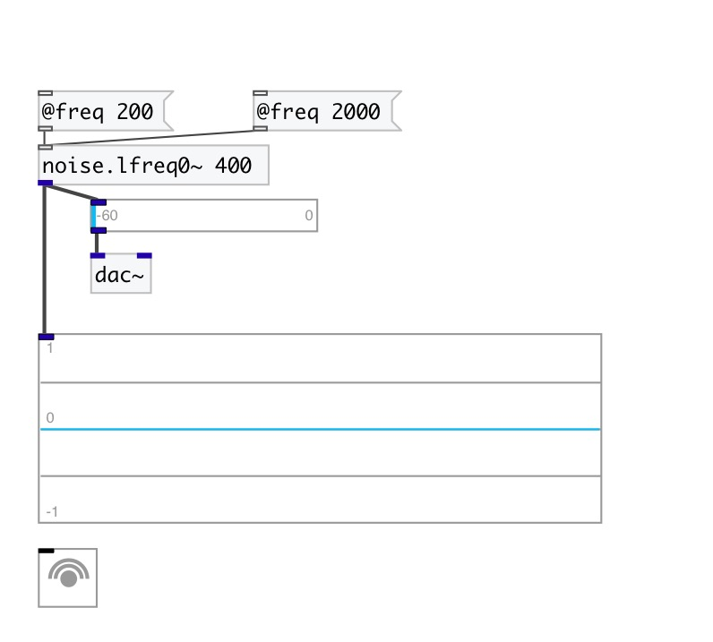
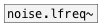

[< reference home](index.html)
---

# noise.lfreq0~

sampled/held noise (piecewise constant)

---

new random number every int(SR/freq) samples or so
 

---

---
arguments:

FREQ: noise generation freq 

---
properties:

@freq: noise
            generation freq. New random number every int(SR/freq) 
@active: on/off dsp
            processing 

---
see also: 

