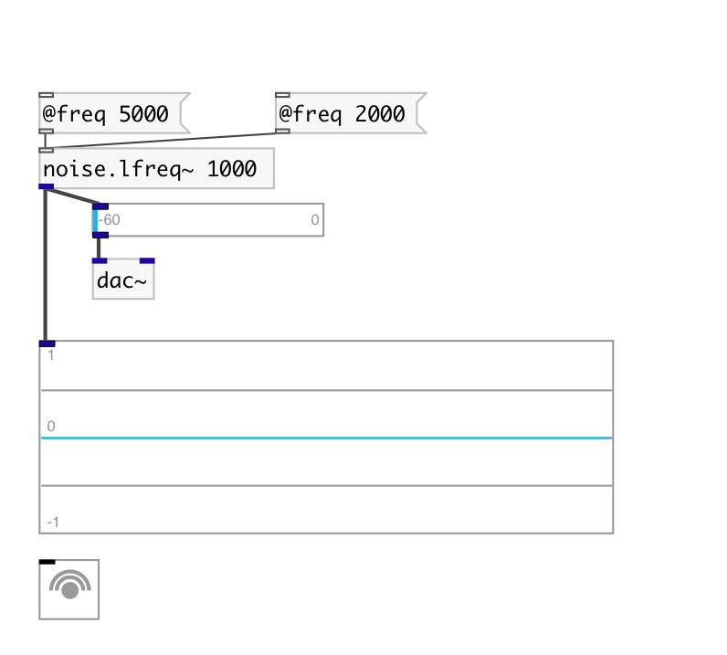

[< reference home](index.html)
---

# noise.lfreq~

noise.lfreq0~ smoothed with no overshoot

---

 

---

---
arguments:

FREQ: noise generation freq 

---
properties:

@freq: noise
            generation freq 
@active: on/off dsp
            processing 

---
see also: 

