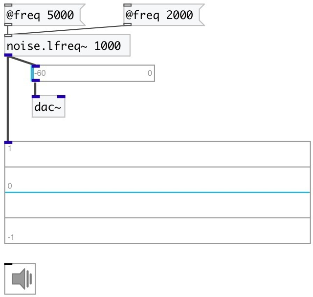

[index](index.html) :: [noise](category_noise.html)
---

# noise.lfreq~

###### noise.lfreq0~ smoothed with no overshoot

*available since version:* 0.2

---

## arguments:

* **FREQ**
noise generation freq 
_type:_ float 

## properties:

* **@freq** 
Get/set noise generation freq 
_type:_ float 
_units:_ Hz 
_range:_ 5..22050 
_default:_ 1000 

* **@active** 
Get/set on/off dsp processing 
_type:_ int 
_enum:_ 0, 1 
_default:_ 1 

## inlets:

* set average frequency 
_type:_ control

## outlets:

* output signal 
_type:_ audio

## keywords:

[noise](keywords/noise.html)
[lfreq](keywords/lfreq.html)

**See also:**
[\[noise.lfreq0~\]](noise.lfreq0~.html)

**Authors:** Serge Poltavsky

**License:** GPL3 or later

