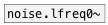

[< reference home](ceammc_lib.html)
---

# noise.lfreq~


noise.lfreq0~ smoothed with no overshoot

---

<br>


---


```


[@freq 5000( [@freq 2000(
|            |
[noise.lfreq~ 1000]
|  |
|  [ui.gain~ @size 120 16]
|  |
|  [dac~]
|
|
[ui.scope~ @size=300x100]


[ui.dsp~]

            
```

---
arguments:

FREQ: noise generation freq<br>

---
properties:

@freq: noise
            generation freq<br>
@active: on/off dsp
            processing<br>

---
see also:<br>
[](noise.lfreq0~.html)
