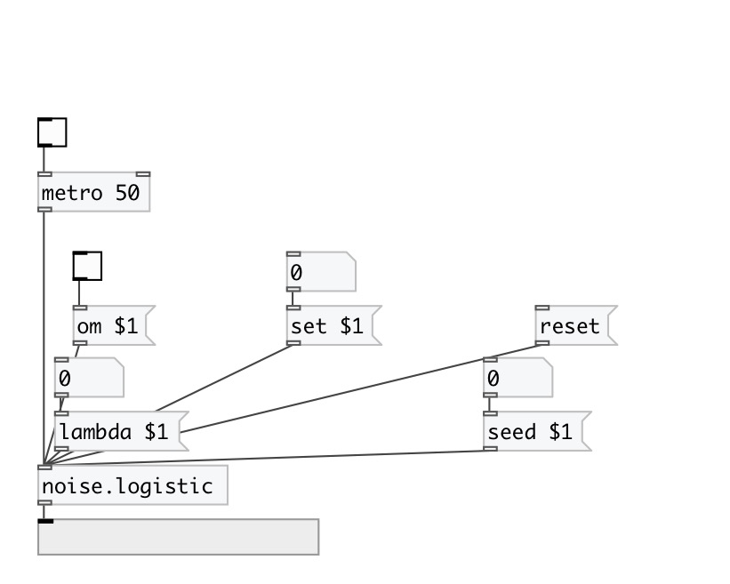

[< reference home](index.html)
---

# noise.logistic

Part of a-chaos library

---

logistic distribution
 

---

---
arguments:

ARG0: a value (optional) 
ARG1: b value (optional) 
ARG2: x value (optional) 
ARG3: y value (optional) 

---
properties:

