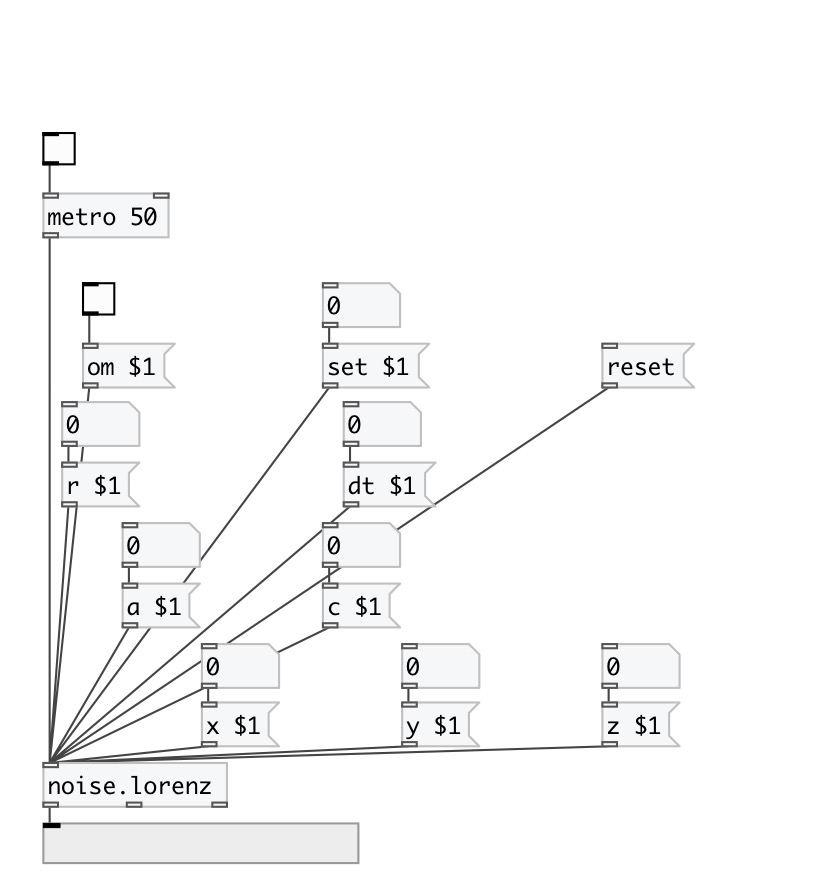

[< reference home](index.html)
---

# noise.lorenz

Part of a-chaos library

---

Lorenz chaos by Heuns method - extra accuracy
sigma replaced with a
b replaced with c
 

---

---
arguments:

ARG0: x value (optional) 
ARG1: y value (optional) 
ARG2: z value (optional) 
ARG3: a value (optional) 
ARG4: r value (optional) 
ARG5: c value (optional) 
ARG6: dt value (optional) 

---
properties:

