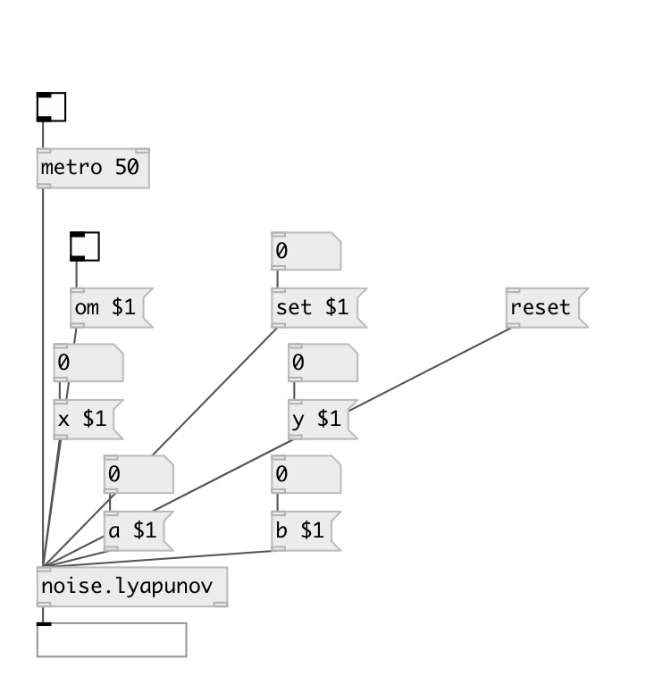

[index](index.html) :: [noise](category_noise.html)
---

# noise.lyapunov

###### Part of a-chaos library

*available since version:* .5

---

## information
inspired by Paul Bourke, implementation by André Sier
---
lyapunov random attractors
---
Paul Bourke&#39;s words
            http://astronomy.swin.edu.au/%7Epbourke/fractals/lyapunov/
---
On average 98% of the random selections of (an, bn) result in an infinite
            series.
This is so common because of the range (-2 &lt;= a,b &lt;= 2) for each of the
            parameters a and b, the number of infinite cases will reduce greatly with a smaller
            range.
About 1% were point attractors, and about 0.5% were periodic basins of
            attraction.
===
xn+1 = a0 + a1 xn + a2 xn2 + a3 xn yn + a4 yn + a5 yn2
yn+1 = b0 + b1 xn + b2 xn2 + b3 xn yn + b4 yn + b5 yn2
===
see references in object&#39;s source code

## arguments:

* **ARG0**
a value (optional) 
_type:_ float 

* **ARG1**
b value (optional) 
_type:_ float 

* **ARG2**
x value (optional) 
_type:_ float 

* **ARG3**
y value (optional) 
_type:_ float 

## methods:

* **set**
 
  __parameters:__
  - **SET** set to value 
    type: float  
    required: True  

* **reset**
reset state 

* **om**
 
  __parameters:__
  - **OM** enables output when cut or fold value is changed 
    type: int  
    required: True  

* **a**
 
  __parameters:__
  - **A** a value 
    type: float  
    required: True  

* **b**
 
  __parameters:__
  - **B** b value 
    type: float  
    required: True  

* **x**
 
  __parameters:__
  - **NX** x value 
    type: float  
    required: True  

* **y**
 
  __parameters:__
  - **NY** y value 
    type: float  
    required: True  

## inlets:

* output value 
_type:_ control

## outlets:

* main outlet 
_type:_ control

## keywords:

[noise](keywords/noise.html)

**Authors:** André Sier

**License:** %

