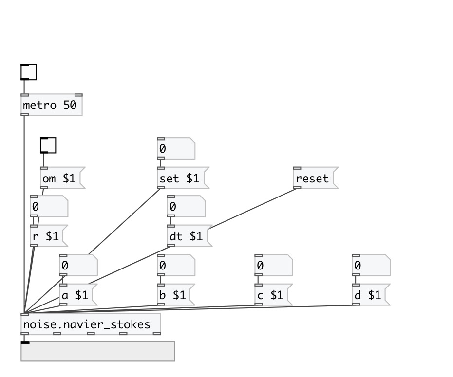

[< reference home](index.html)
---

# noise.navier_stokes

Part of a-chaos library

---

            A model obtained by a suitable five-mode truncation 
of the Navier-Stokes equations for a two-dimensional 
incompressible fluid on a torus:

dx1= -2*x1 + 4*x2*x3 + 4*x4*x5

dx2= -9*x2 + 3*x1*x3

dx3= -5*x3 - 7*x1*x2 + reyn

dx4= -5*x4 - x1*x5

dx5= -x5 - 3*x1*x4

---

Where &lt;reyn&gt; is the Reynolds number,
and exibits  an interesting variety of different behaviors for different 
ranges of &lt;reyn&gt;. For the critical values of &lt;reyn&gt;, the most interesting
feature is the stochastic behavior observed when  R1 &lt; &lt;reyn&gt; &lt; R2.
With 28.73 &lt; R1 &gt; 29.0 and R2 ± = 33.43.
 

---

---
arguments:

ARG0: a value (optional) 
ARG1: b value (optional) 
ARG2: c value (optional) 
ARG3: d value (optional) 
ARG4: r value (optional) 
ARG5: dt value (optional) 

---
properties:

