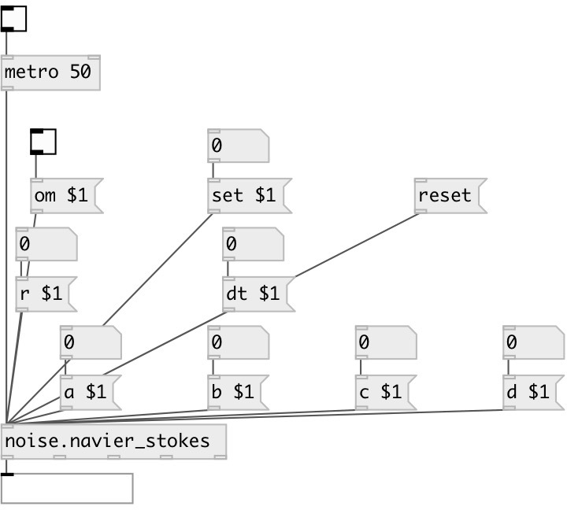

[index](index.html) :: [noise](category_noise.html)
---

# noise.navier_stokes

###### Part of a-chaos library

*available since version:* .5

---

## information
A model obtained by a suitable five-mode truncation of the Navier-Stokes equations for a two-dimensional incompressible fluid on a torus: dx1= -2*x1 + 4*x2*x3 + 4*x4*x5 dx2= -9*x2 + 3*x1*x3 dx3= -5*x3 - 7*x1*x2 + reyn dx4= -5*x4 - x1*x5 dx5= -x5 - 3*x1*x4 --- Where is the Reynolds number, and exibits an interesting variety of different behaviors for different ranges of . For the critical values of , the most interesting feature is the stochastic behavior observed when R1 29.0 and R2 ± = 33.43.

## arguments:

* **ARG0**
a value (optional) 
_type:_ float 

* **ARG1**
b value (optional) 
_type:_ float 

* **ARG2**
c value (optional) 
_type:_ float 

* **ARG3**
d value (optional) 
_type:_ float 

* **ARG4**
r value (optional) 
_type:_ float 

* **ARG5**
dt value (optional) 
_type:_ float 

## methods:

* **set**
 
  __parameters:__
  - **SET** set to value 
    type: float  
    required: True  

* **reset**
reset state 

* **om**
 
  __parameters:__
  - **OM** enables output when cut or fold value is changed 
    type: int  
    required: True  

* **a**
 
  __parameters:__
  - **A** a value 
    type: float  
    required: True  

* **b**
 
  __parameters:__
  - **B** b value 
    type: float  
    required: True  

* **c**
 
  __parameters:__
  - **C** c value 
    type: float  
    required: True  

* **d**
 
  __parameters:__
  - **D** d value 
    type: float  
    required: True  

* **r**
 
  __parameters:__
  - **R** r value 
    type: float  
    required: True  

* **dt**
 
  __parameters:__
  - **DT** dt value 
    type: float  
    required: True  

* **om**
 
  __parameters:__
  - **OM** enables output when cut or fold value is changed 
    type: int  
    required: True  

## inlets:

* output value 
_type:_ control

## outlets:

* main outlet 
_type:_ control

## keywords:

[noise](keywords/noise.html)

**Authors:** Richard Dudas, André Sier

**License:** %

