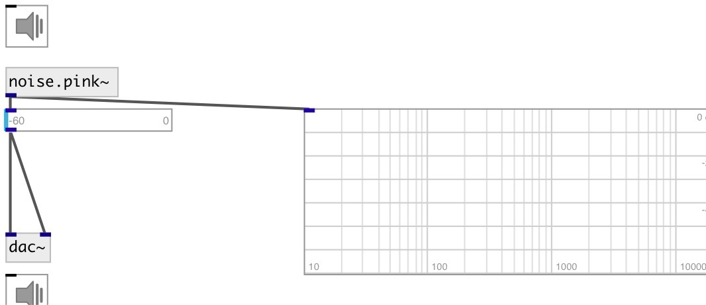

[index](index.html) :: [noise](category_noise.html)
---

# noise.pink~

###### Pink noise generator

*available since version:* 0.1

---

## information
Pink noise or 1/f noise is a signal or process with a frequency spectrum such that
            the power spectral density (energy or power per frequency interval) is inversely
            proportional to the frequency of the signal.
In pink noise, each octave (halving/doubling in frequency) carries an equal amount
            of noise energy.
The name arises from the pink appearance of visible light with this power
            spectrum.

## properties:

* **@active** 
Get/set on/off dsp processing 
__type:__ int 
__enum:__ 0, 1 
__default:__ 1 

## outlets:

* output signal
__type:__ audio 

## keywords:

[noise](keywords/noise.html)
[pink](keywords/pink.html)

**See also:**
[\[noise.white~\]](noise.white~.html)

**Authors:** Serge Poltavsky

**License:** GPL3 or later

