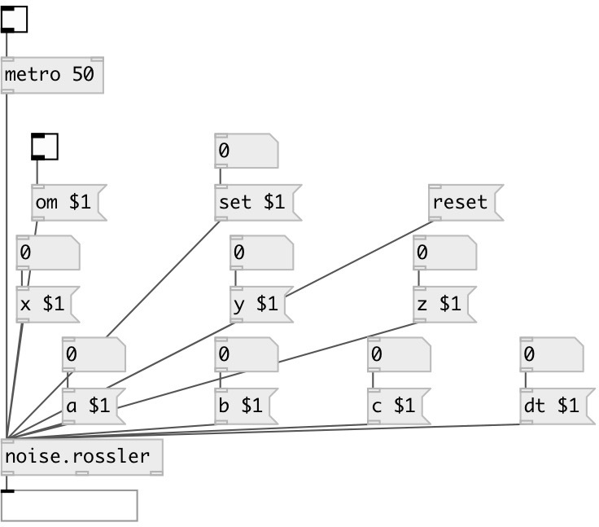

[index](index.html) :: [noise](category_noise.html)
---

# noise.rossler

###### Part of a-chaos library

*available since version:* .5

---

## information
Heuns&#39; method

## arguments:

* **ARG0**
x value (optional) 
_type:_ float 

* **ARG1**
y value (optional) 
_type:_ float 

* **ARG2**
z value (optional) 
_type:_ float 

* **ARG3**
a value (optional) 
_type:_ float 

* **ARG4**
b value (optional) 
_type:_ float 

* **ARG5**
c value (optional) 
_type:_ float 

* **ARG6**
dt value (optional) 
_type:_ float 

## methods:

* **set**
 
  __parameters:__
  - **SET** set to value 
    type: float  
    required: True  

* **reset**
reset state 

* **om**
 
  __parameters:__
  - **OM** enables output when cut or fold value is changed 
    type: int  
    required: True  

* **a**
 
  __parameters:__
  - **A** a value 
    type: float  
    required: True  

* **b**
 
  __parameters:__
  - **B** b value 
    type: float  
    required: True  

* **c**
 
  __parameters:__
  - **C** c value 
    type: float  
    required: True  

* **dt**
 
  __parameters:__
  - **D** dt value 
    type: float  
    required: True  

* **x**
 
  __parameters:__
  - **NX** x value 
    type: float  
    required: True  

* **y**
 
  __parameters:__
  - **NY** y value 
    type: float  
    required: True  

* **z**
 
  __parameters:__
  - **NZ** z value 
    type: float  
    required: True  

## inlets:

* output value 
_type:_ control

## outlets:

* main outlet 
_type:_ control

## keywords:

[noise](keywords/noise.html)

**Authors:** André Sier

**License:** %

