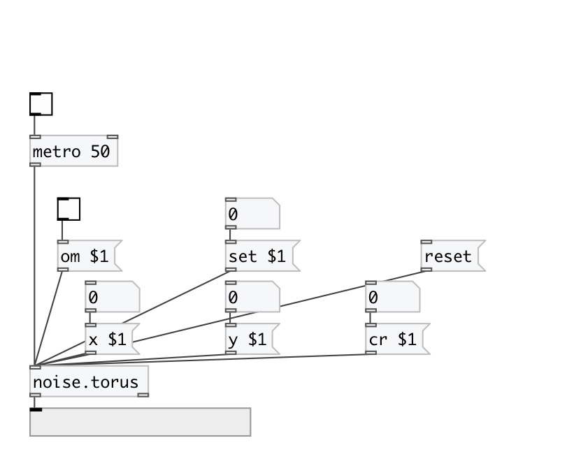

[< reference home](index.html)
---

# noise.torus

Part of a-chaos library

---

            a-torus
try these parameters:
0.7 1.1 1.3
0.9 1. 1.6
 

---

---
arguments:

ARG0: x value (optional) 
ARG1: y value (optional) 
ARG2: cr value (optional) 

---
properties:

